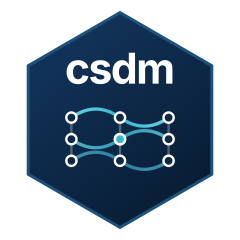

# csdm 

<!-- badges: start -->
[](https://CRAN.R-project.org/package=csdm)
[](https://github.com/Macosso/csdm/actions/workflows/R-CMD-check.yaml)
[](https://app.codecov.io/gh/Macosso/csdm?branch=master)
[](https://cran.r-project.org/package=csdm)
[](https://macosso.r-universe.dev/csdm)
<!-- badges: end -->

`csdm` estimates heterogeneous panel models when units may share unobserved
common factors. It provides mean-group (MG), common correlated effects (CCE),
dynamic CCE (DCCE), and cross-sectionally augmented ARDL (CS-ARDL) estimators,
along with residual cross-sectional dependence diagnostics.

The package follows the econometric structure used by Stata's `xtdcce2`, while
using standard R model methods and explicit specification objects. It does not
yet implement every `xtdcce2` option.

## Installation

Install the CRAN release:

```r
install.packages("csdm")
```

Install the development version:

```r
install.packages("remotes")
remotes::install_github("Macosso/csdm")
```

## Estimators

| `model` | Estimator | Cross-sectional averages | Dynamics | Long-run output |
|---|---|---:|---:|---:|
| `"mg"` | Mean Group | No | No | No |
| `"cce"` | Common Correlated Effects | Yes | No | No |
| `"dcce"` | Dynamic CCE | Optional | Yes | No |
| `"cs_ardl"` | Cross-sectionally augmented ARDL | Optional | Yes | Yes |

All four estimators fit unit-specific regressions and average the eligible
unit-level coefficients. CCE-based models add cross-sectional averages as
proxies for latent common factors. CS-ARDL derives adjustment and long-run
parameters from the fitted unit-level ARDL coefficients.

## Quick start

The bundled data contain 93 countries observed annually from 1960 through
2007. The example below uses 12 countries from 1970 onward so it runs quickly.

```r
library(csdm)

data(PWT_60_07, package = "csdm")
keep_ids <- unique(PWT_60_07$id)[1:12]
dat <- subset(PWT_60_07, id %in% keep_ids & year >= 1970)

form <- log_rgdpo ~ log_hc + log_ck + log_ngd
csa_vars <- c("log_rgdpo", "log_hc", "log_ck", "log_ngd")

mg <- csdm(form, data = dat, id = "id", time = "year", model = "mg")

cce <- csdm(
  form, data = dat, id = "id", time = "year", model = "cce",
  csa = csdm_csa(vars = csa_vars)
)

dcce <- csdm(
  form, data = dat, id = "id", time = "year", model = "dcce",
  csa = csdm_csa(vars = csa_vars, lags = 3),
  lr = csdm_lr(type = "ardl", ylags = 1, xdlags = 0)
)

cs_ardl <- csdm(
  form, data = dat, id = "id", time = "year", model = "cs_ardl",
  csa = csdm_csa(vars = csa_vars, lags = 3),
  lr = csdm_lr(type = "ardl", ylags = 1, xdlags = 0)
)

summary(cce)
coef(cs_ardl, component = "long_run")
vcov(cs_ardl, component = "long_run")
```

`csdm_csa()` controls the variables and lags used for cross-sectional
averages. `csdm_lr()` controls lags of the dependent variable and regressors.
Numeric time indexes use `time_step = 1` by default, and lag construction
preserves gaps in calendar time.

## Cross-sectional dependence diagnostics

`cd_test()` accepts a fitted `csdm` model or an `N` by `T` residual matrix:

```r
cd_test(cce, type = "CD")
cd_test(cce, type = "all", seed = 42)
```

The available diagnostics are classical CD, randomized CDw, power-enhanced
CDw+, and bias-corrected CD\*. CD uses pairwise-complete observations by
default. CDw, CDw+, and CD\* require a balanced residual sample. Periods with no
finite residuals for any retained unit are removed automatically; for partially
observed periods, request a common sample explicitly:

```r
cd_test(cce, type = "all", seed = 42,
        na.action = "drop.incomplete.times")
```

Use a fixed `seed` when reporting CDw or CDw+ because their Rademacher weights
are random. The tests use different corrections and should be interpreted
against their own assumptions; agreement among p-values is not a substitute
for checking those assumptions.

## R model interface

Fitted models support the model methods expected by downstream R tools:

```r
coef(cce)
vcov(cce)
residuals(cce)                  # unit-by-time matrix
residuals(cce, format = "long")
fitted(cce, format = "vector")
nobs(cce)
model.frame(cce)

library(modelsummary)
modelsummary(list(MG = mg, CCE = cce, DCCE = dcce))
```

`tidy()`, `glance()`, and `augment()` methods are available through the
`generics`/`broom` interface. `update()` refits a model using its stored call and
sample metadata.

## Current scope

- Mean-group inference uses the cross-unit sample covariance of unit estimates
  divided by the number of eligible units and large-`N` normal approximations.
- CCE identification depends on cross-sectional averages spanning the relevant
  common-factor space. DCCE and CS-ARDL additionally require sufficient time
  observations for the requested lags.
- CS-ARDL reports levels coefficients, an implied adjustment coefficient, and
  implied long-run ratios. It does not fit a separate ECM or establish
  cointegration.
- Pooled restrictions, estimation weights, alternative fit-level covariance
  estimators, CS-DL, CS-ECM, and prediction on new data are not implemented.
- `csdm_pooled()`, `get_residuals()`, `prepare_cd_input()`, and the low-level
  covariance helpers are deprecated. Use standard model methods on fitted
  objects.

Corrected estimation samples and covariance calculations in the development
version can change results from earlier releases. Refit saved models after
upgrading.

## Documentation

- [Introduction and worked examples](https://macosso.github.io/csdm/articles/introduction_to_csdm.html)
- [Function reference](https://macosso.github.io/csdm/reference/)
- [Issue tracker](https://github.com/Macosso/csdm/issues)

Methodological foundations include Pesaran and Smith (1995), Pesaran (2006),
Chudik and Pesaran (2015), Juodis and Reese (2022), and Pesaran and Xie (2022).
