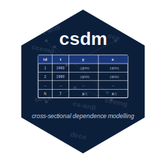

```{r setup, include = FALSE}
knitr::opts_chunk$set(
  collapse = TRUE,
  comment = "#>",
  warning = FALSE,
  message = FALSE
)

library(csdm)
```



---

## Overview

The `csdm` package implements econometric methods for panel data with cross-sectional dependence (CSD). In many applications, observations across units (e.g., countries, firms, regions) are not independent—macroeconomic shocks, trade relationships, or spillovers create correlation across cross-sectional units. The `csdm` package provides robust estimators that account for this dependence structure, plus diagnostic tests to detect and characterize it.

This vignette demonstrates four core estimation methods and related inference tools on real panel data from the Penn World Table (PWT).

## Methodology: Four Estimators

### Model Specification

The `csdm()` interface estimates heterogeneous panel data models with optional cross-sectional augmentation and dynamic structure. Let \(i = 1, \ldots, N\) index cross-sectional units and \(t = 1, \ldots, T\) index time. A baseline heterogeneous panel model is

$$
y_{it} = \alpha_i + \beta_i' x_{it} + u_{it},
\qquad i = 1, \ldots, N,\; t = 1, \ldots, T
$$

where:

- \(y_{it}\) is the outcome variable for unit \(i\) at time \(t\)
- \(\alpha_i\) is a unit-specific intercept
- \(\beta_i\) is a \((k \times 1)\) vector of unit-specific slopes
- \(x_{it}\) is a \((k \times 1)\) vector of explanatory variables
- \(u_{it}\) is the error term, which may exhibit cross-sectional dependence

The inner product \(\beta_i' x_{it}\) is scalar-valued. Heterogeneous slopes allow each unit to respond differently to the regressors. In many applications, cross-sectional dependence arises because the error term contains unobserved common factors. The estimators implemented in `csdm()` differ in how they handle this dependence and whether they allow for dynamic adjustment.

---

### 1. Mean Group (MG) Estimator

The Mean Group estimator fits separate regressions for each unit and averages the resulting coefficients:

$$
\hat{\beta}_{MG} = \frac{1}{N}\sum_{i=1}^N \hat{\beta}_i
$$

**Key idea**: Estimation is performed unit by unit, with no pooling of slope coefficients across cross-sectional units.

**Interpretation**:

- \(\hat{\beta}_{MG}\) is the cross-sectional average of the unit-specific estimates
- all slope coefficients are allowed to differ across units

**Properties**:

- accommodates slope heterogeneity
- requires sufficient time-series information within each unit
- does not explicitly model cross-sectional dependence

**Use case**: A natural benchmark when the main concern is heterogeneous slopes and no explicit factor structure is imposed.

---

### 2. Common Correlated Effects (CCE) Estimator

The CCE estimator augments each unit regression with cross-sectional averages to proxy unobserved common factors:

$$
y_{it} = \alpha_i + \beta_i' x_{it} + \gamma_i' \bar{z}_t + v_{it}
$$

where \(\bar{z}_t\) collects the cross-sectional averages specified through `csdm_csa()`, for example

$$
\bar{z}_t = (\bar{y}_t, \bar{x}_t),
\qquad
\bar{x}_t = \frac{1}{N}\sum_{i=1}^N x_{it},
\qquad
\bar{y}_t = \frac{1}{N}\sum_{i=1}^N y_{it}.
$$

**Key idea**: Cross-sectional averages serve as proxies for latent common factors that induce dependence across units.

**Interpretation**:

- \(\beta_i\) measures the unit-specific effect conditional on the included cross-sectional averages
- \(\gamma_i\) captures unit-specific exposure to the common components with \(\bar{z}_t\) as a proxy.

**Properties**:

- allows heterogeneous slopes
- augments the regression with cross-sectional averages supplied through `csa`
- suitable when cross-sectional dependence is driven by latent common shocks

**Use case**: When dependence across units is believed to reflect common unobserved factors.

---

### 3. Dynamic CCE (DCCE) Estimator

The DCCE estimator extends CCE to dynamic settings by including lagged dependent variables, optional distributed lags of regressors, and lagged cross-sectional averages:

$$
y_{it}
=
\alpha_i
+ \sum_{p=1}^{P} \phi_{ip} y_{i,t-p}
+ \sum_{q=0}^{Q} \beta_{iq}' x_{i,t-q}
+ \sum_{s=0}^{S} \delta_{is}' \bar{z}_{t-s}
+ e_{it}
$$

where the dynamic structure is controlled through `csdm_lr()` and the cross-sectional averages and their lags are controlled through `csdm_csa()`.

**Key idea**: Dynamics are introduced directly in the unit equation, while lagged cross-sectional averages help absorb common factor dependence over time.

**Interpretation**:

- \(\phi_{ip}\) captures unit-specific persistence
- \(\beta_{iq}\) captures contemporaneous and lagged effects of regressors
- \(\delta_{is}\) captures the effect of contemporaneous and lagged common components

**Properties**:

- allows heterogeneous dynamic adjustment across units
- combines lagged dependent variables, optional distributed lags, and cross-sectional augmentation
- requires enough time periods to support the chosen lag structure

**Use case**: When the outcome is persistent over time and cross-sectional dependence remains important.

---

### 4. Cross-Sectionally Augmented ARDL (CS-ARDL)

In the current `csdm()` implementation, `model = "cs_ardl"` is obtained by first estimating a cross-sectionally augmented ARDL-style regression in levels, using the same dynamic specification as `model = "dcce"`, and then transforming the estimated unit-specific coefficients into adjustment and long-run parameters.

The underlying unit-level regression is

$$
y_{it}
=
\alpha_i
+ \sum_{p=1}^{P} \phi_{ip} y_{i,t-p}
+ \sum_{q=0}^{Q} \beta_{iq}' x_{i,t-q}
+ \sum_{s=0}^{S} \omega_{is}' \bar{z}_{t-s}
+ e_{it}
$$

From this dynamic specification, the implied error-correction form is

$$
\Delta y_{it}
=
\alpha_i
+ \varphi_i \left( y_{i,t-1} - \theta_i' x_{i,t-1} \right)
+ \sum_{j=1}^{P-1} \lambda_{ij} \Delta y_{i,t-j}
+ \sum_{j=0}^{Q-1} \psi_{ij}' \Delta x_{i,t-j}
+ \sum_{s=0}^{S} \tilde{\omega}_{is}' \bar{z}_{t-s}
+ e_{it}
$$

where the dynamic structure is controlled through `csdm_lr()` and the cross-sectional averages are supplied through `csdm_csa()`.

**Key idea**: `cs_ardl` reports the implied short-run and long-run quantities from a cross-sectionally augmented ARDL fit.

**Interpretation**:

- \(\theta_i\) is the unit-specific long-run relationship
- \(\varphi_i\) is the implied speed of adjustment back toward equilibrium
- \(\psi_{ij}\) captures short-run effects of changes in regressors
- \(\tilde{\omega}_{is}\) captures the role of common cross-sectional components

**Properties**:

- supports heterogeneous short-run and long-run dynamics
- combines ARDL-style dynamics with cross-sectional augmentation
- recovers adjustment and long-run coefficients from estimated lag polynomials rather than fitting a separate ECM directly

**Use case**: When the objective is to study long-run relationships together with heterogeneous short-run adjustment in panels affected by common factors.

---

### Cross-Sectional Averages and Dynamic Structure

Two helper specifications control the main extensions in `csdm()`:

- `csdm_csa()` defines which variables enter as cross-sectional averages and how many lags of those averages are included
- `csdm_lr()` defines the dynamic or long-run structure, such as lagged dependent variables and distributed lags

This design keeps the estimation interface consistent across the four estimators while allowing the model specification to vary by application.

---

### Summary

| Estimator | Heterogeneous Slopes | Cross-Sectional Averages | Dynamics | Long-Run Structure |
|-----------|----------------------|--------------------------|----------|--------------------|
| MG        | Yes                  | No                       | No       | No |
| CCE       | Yes                  | Yes                      | No       | No |
| DCCE      | Yes                  | Yes                      | Yes      | No |
| CS-ARDL   | Yes                  | Yes                      | Yes      | Yes |

## Data: Penn World Table Subset

The `PWT_60_07` dataset contains macroeconomic indicators for 93 countries covering 1960–2007 (48 years). Key variables include:

- `id`: Country identifier
- `year`: Calendar year (1960–2007)
- `log_rgdpo`: Log real GDP per capita
- `log_hc`: Log human capital index
- `log_ck`: Log capital stock
- `log_ngd`: Log government debt (control variable)

```{r load-data}
data(PWT_60_07, package = "csdm")
head(PWT_60_07, 10)
str(PWT_60_07)

# For computational speed in this vignette, use a subset: 
# first 15 countries, 1970-2007
first_15_ids <- unique(PWT_60_07$id)[1:15]
df <- subset(PWT_60_07, id %in% first_15_ids & year >= 1970 & year <= 2007)
```

The panel is relatively balanced. We will use growth regressions: modeling log-GDP (`log_rgdpo`) as a function of human capital (`log_hc`), capital stock (`log_ck`), and government debt (`log_ngd`), and test cross-sectional dependence in residuals.

## Package installation
To install the `csdm` package from CRAN, run:
```{r install-package, eval = FALSE}
install.packages("csdm")
```

To install the latest development version from GitHub, run:
```{r install-github, eval = FALSE}
install.packages("remotes")
remotes::install_github("Macosso/csdm")
```

## Model Estimation: Four Examples


All models are fitted with `csdm()`, which automatically detects the input structure and applies the appropriate methodology. The key arguments are `id` and `time` to specify the cross-sectional and time-period identifiers, and `model` to choose the estimator. For CCE and DCCE, additional arguments (`csa` and `lr`) specify treatment of cross-sectional averages and dynamics.

### Example 1: Mean Group (MG) Estimation

```{r mg-fit}
# MG: Separate regression per country, then average coefficients
fit_mg <- csdm(
  log_rgdpo ~ log_hc + log_ck + log_ngd,
  data = df,
  id = "id", 
  time = "year",
  model = "mg"
)

print(fit_mg)
summary(fit_mg)
```

**Interpretation**: The MG estimate suggests that on average across countries, increases in human capital, capital stock, and changes in debt are associated with changes in real GDP. The standard errors reflect cross-country heterogeneity in these relationships.

### Example 2: Common Correlated Effects (CCE)

```{r cce-fit}
# CCE: Add cross-sectional means to control for common shocks
fit_cce <- csdm(
  log_rgdpo ~ log_hc + log_ck + log_ngd,
  data = df,
  id = "id", 
  time = "year",
  model = "cce",
  csa = csdm_csa(vars = c("log_rgdpo", "log_hc", "log_ck", "log_ngd"))
)

print(fit_cce)
summary(fit_cce)
```

**Interpretation**: After accounting for global shocks (via cross-sectional averages of all variables), the CCE coefficients and standard errors may differ from MG. This indicates whether common factors (e.g., technology, energy prices) are a major source of cross-sectional dependence.

### Example 3: Dynamic CCE (DCCE)

```{r dcce-fit}
# DCCE: Include dynamics and cross-sectional means
# Use lagged dependent variable to capture dynamic adjustment
fit_dcce <- csdm(
  log_rgdpo ~ log_hc + log_ck + log_ngd,
  data = df,
  id = "id", 
  time = "year",
  model = "dcce",
  csa = csdm_csa(
    vars = c("log_rgdpo", "log_hc", "log_ck", "log_ngd"), 
    lags = 3
  ),
  lr = csdm_lr(type = "ardl", ylags = 1, xdlags = 0)
)

print(fit_dcce)
summary(fit_dcce)
```

**Interpretation**: The DCCE model includes lagged GDP to capture dynamic adjustment. The lagged coefficient typically lies between 0.8–0.95, indicating strong income persistence. The coefficients on other variables represent short-run elasticities; to compute long-run effects, divide by $(1 - \text{lag coefficient})$.

### Example 4: Cross-Sectionally Augmented ARDL (CS-ARDL)

```{r csardl-fit}
# CS-ARDL: Separate short-run and long-run dynamics
# Includes lagged dependent and lagged regressors
fit_csardl <- csdm(
  log_rgdpo ~ log_hc + log_ck + log_ngd,
  data = df,
  id = "id", 
  time = "year",
  model = "cs_ardl",
  csa = csdm_csa(
    vars = c("log_rgdpo", "log_hc", "log_ck", "log_ngd"), 
    lags = 3
  ),
  lr = csdm_lr(type = "ardl", ylags = 1, xdlags = 0)
)

print(fit_csardl)
summary(fit_csardl)
```

**Interpretation**: The CS-ARDL model returns both short-run coefficients (immediate response to shocks) and long-run coefficients (equilibrium effect after full adjustment). The long-run elasticities are often larger than short-run responses, consistent with gradual accumulation effects in capital and human capital.

## Cross-Sectional Dependence Testing

After fitting a model, we can test whether residuals exhibit cross-sectional dependence using the Pesaran CD test and related variants. CSD tests detect whether residuals $u_{it}$ are correlated across units—a key assumption violation that can bias standard errors.

### Four CD Test Types

All CD tests have null hypothesis: **residuals are cross-sectionally independent**.

#### 1. Pesaran CD Test

The Pesaran CD statistic is:

$$CD = \sqrt{\frac{2}{N(N-1)}} \sum_{i=1}^{N-1} \sum_{j=i+1}^{N} \hat{\rho}_{ij} \sqrt{T}$$

where $\hat{\rho}_{ij}$ is the cross-sectional correlation between residuals of units $i$ and $j$. The test statistic is approximately standard normal under the null.

**Interpretation**: Large $|CD|$ rejects independence; both positive and negative correlations are flagged. This is the most general CD test and works even when $N$ is fixed and $T \to \infty$.

#### 2. Pesaran CD Weighted (CDw)

The CDw statistic applies unit-level random sign weights to the cross-sectional correlations:

$$CD_w = \sqrt{\frac{2}{N(N-1)}} \sum_{i=1}^{N-1} \sum_{j=i+1}^{N} w_i w_j \hat{\rho}_{ij} \sqrt{T}$$

where weights $w_i \in \{-1,1\}$ are independent random sign flips assigned at the unit level and held fixed within a replication. This random-weighting scheme improves the behavior of the test in the presence of heteroskedasticity.

#### 3. Pesaran CD Weighted Plus (CDw+)

CDw+ uses the same unit-level random sign weights but applies them to a bias-adjusted version of the CD statistic:

$$CD_w^+ = \sqrt{\frac{2}{N(N-1)}} \sum_{i=1}^{N-1} \sum_{j=i+1}^{N} w_i w_j \hat{\rho}_{ij}^+ \sqrt{T}$$

where $\hat{\rho}_{ij}^+$ denotes the adjusted cross-sectional correlation. CDw+ is designed to improve robustness in large panels with heteroskedasticity.

#### 4. Pesaran CD*, Fan-Liao-Yao (FLY)

The CD* statistic is a semiparametric refinement for large $N$ and $T$:

$$CD^* = \frac{1}{\sqrt{N(N-1)}} \sum_{i=1}^{N-1} \sum_{j=i+1}^{N} (\hat{\rho}_{ij}^2 - \tau_T)$$

where $\tau_T$ is a variance adjustment. FLY-type tests are designed for large panel dimensions and provide robustness against certain forms of weak cross-sectional dependence.

### Running CD Tests with Seed Selection

The `cd_test()` function accepts the fitted model and computes all test variants. Tests use a **random seed** to initialize pseudo-random computations (for `cdw` and `cdw+`); setting a `seed` ensures reproducibility of numerical results across runs.

```{r cd-tests}
# Test MG residuals for CSD
cd_mg <- cd_test(fit_mg, type = "CD")
print(cd_mg)

# Test CCE residuals for CSD
set.seed(1234)
cd_cce <- cd_test(fit_cce, type = "all")
print(cd_cce)

# Test DCCE residuals for CSD
set.seed(1234)
cd_dcce <- cd_test(fit_dcce, type = "CDw")
print(cd_dcce)

# Test CS-ARDL residuals for CSD
set.seed(1234)
cd_csardl <- cd_test(fit_csardl, type = "all")
print(cd_csardl)
```

**Interpreting Results**: 

- **CD statistic p-value < 0.05**: Reject null of CSD independence; residuals are correlated across units.
- **CDw, CDw+, CD* variants**: Provide robustness checks; if all reject the null, CSD is strongly evidenced.
- **Magnitude**: Large $|CD|$ statistics (e.g., $|CD| > 3$) indicate substantial and economically meaningful dependence.

In practice, models that do not account for cross-sectional dependence (like MG without augmentation) typically show significant CD test rejections, justifying the use of CSD-robust methods like CCE and DCCE.

## References

::: {#refs}
:::

---

*For further details on the theoretical foundations and implementation of CSD-robust methods, see the documentation for `?csdm`, `?cd_test`, and `?summary.csdm_fit`.*
